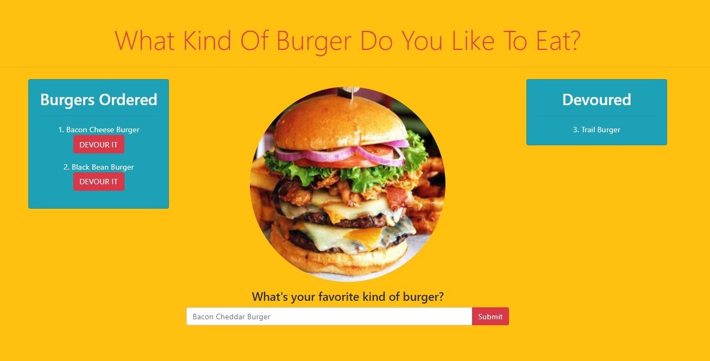
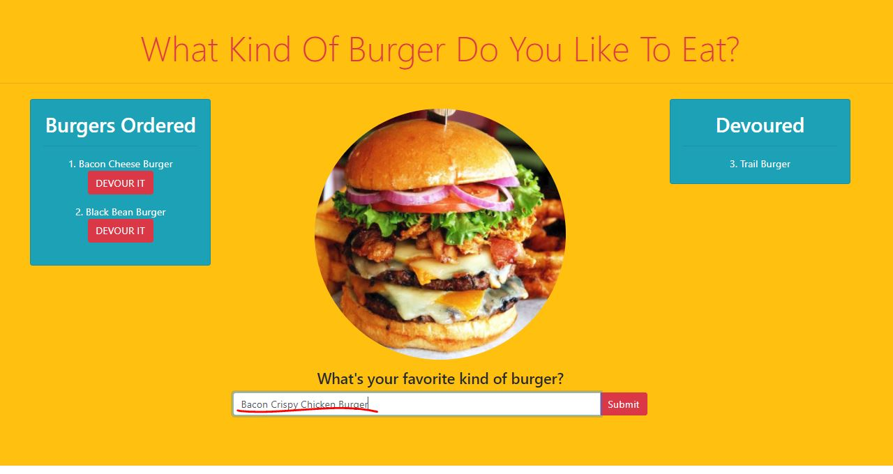
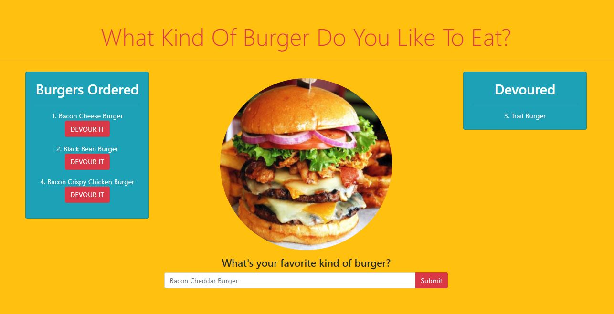
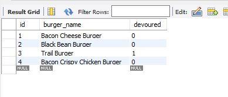

# BurgerJoint

Burger Joint is a restaurant app that allows users to input the name of the burgers they would like to eat.  When a user submits a burger name, the app will display the burger on the left side of the page.  It will then give the user an option to devour the burger.  If the devour button is clicked, the burger name will move to the right side of the page.

## Technologies Used
	1. MySQL	
	2. Node Packages (mysql, express, express-handlebars, body-parser)
	3. Node.js
	4. Bootstrap

